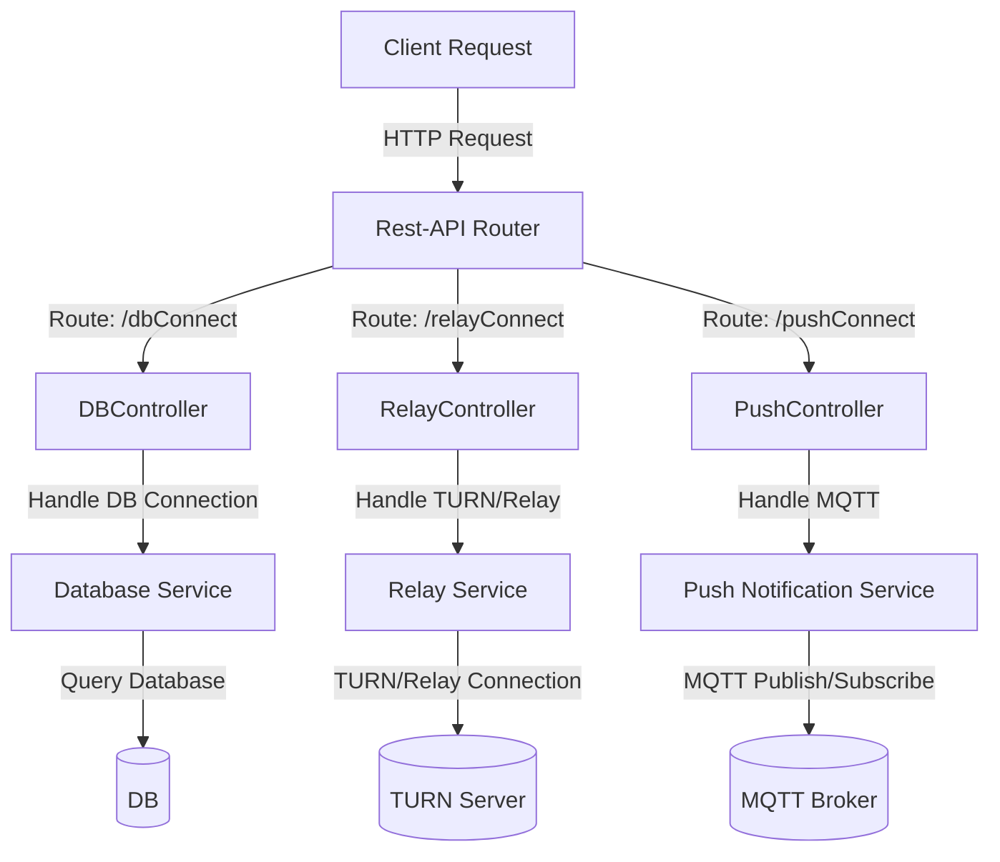
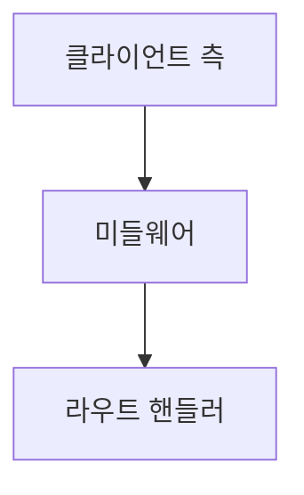
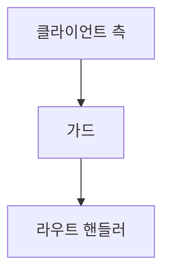

# nestjs 프로젝트 생성
```
npm i -g @nestjs/cli
nest new project-name
```
# 개발모드로 실행
```
npm run start:dev
```
-  main.ts 기본적으로 3000번으로 실행 세팅 되어 있음
- .development.env 파일을 가리키도록 세팅

# 운영환경으로 실행

```
- .production.env 파일을 가리키도록 세팅
```


## 환경 변수 설정
- 어플리케이션은 여러 환경에서 실행됨, 개발자 로컬, STAGE 환경, PRODUCTION 등의 환경으로 보통 구성
- 각 환경에서 사용 되는 변수가 달라지는 것들이 있다면 환경 변수를 다르게 구성할 수 있어야 함

## 요청 유효성 검사
- 프론트엔드에서 들어오는 요청은 잘못된 값을 가지는 경우가 빈번함
- 사용자가 값을 잘못 입력하기도 하고 프론트에서 걸러지지 않은 잘못된 값이 유입되는 경우도 많음
- 백엔드에서는 핵심 로직을 수행하기 전에, 값이 제대로 전달되었는지 판단하여 잘못 전달된 경우라면 에러 메시지로 응답해야함

## 인증
- 사용자의 리소스에 접근하기 위해서는 권한이 필요하고 로그인 과정을 거쳐야함
- 로그인을 거친 유저는 요청마다 로그인을 할 필요는 없고 인증 과정을 거친 다음 후속 동작을 수행할 수 있어야 함

## 로깅
- 서버를 운용하기 위해서는 로그를 잘 기록해야 됨
- 이슈 발생 시 원인을 빠르고 정확하게 파악하는데에 로그가 가장 중요한 역할을 하고 어떤 동작에 대해서 감사 로그를 남겨 외부에 기록을 제출해야 하는 경우도 있음

## 헬스 체크
- 어플리케이션이 잘 돌아가고 있는지 상태가 양호한지 주기적으로 검사함
- 만약에 서버의 상태가 좋지 않다면 경고를 울려서 개발자가 빠르게 대응할 수 있게 방안을 마련해야함

## CQRS
- 복잡한 소프트웨어를 만들다 보면 소스 코드가 스파케티 처럼 얽히게 되는 경우가 생김
- 데이터베이스에 쓰기 및 수정 삭제와 읽기 요청 처리하는 조회 로직을 분리함으로써 성능, 확장성, 보안을 강화할 수 있음

## 클린 아키텍처
- SW 의 계층을 분리하고 저수준의 계층이 고 수준의 계층에 의존하도록 함
- 의존의 방향이 바뀌는 경우가 있다면, 의존 관계 역전 원칙을 활용하여 안정적인 소프트웨어를 작성할 수 있어야 함

## 단위 테스트
- 소프트웨어에 변경이 생긴다면 반드시 테스트를 해야함
- 단위 테스트는 유저의 입장에서 수행하는 테스트가 아닌 개발자가 테스트 코드를 이용하여 수행하는 최소 단위의 테스트 기법
- 개발자가 작성한 코드 조각이 동작하는 조건을 기술하고, 주어진 입력에 대해 원하는 결과가 나오는지 작성할 수 있어야 함

---
## 버전 관리
> **[Major].[Minor].[Patch]-[label]**

- **Major**: 이전 버전과 호환이 불가능할 때 숫자를 하나 증가시킴
- **Minor**: 기능이 추가 되는 경우 숫자를 증가 시킴
- **Patch**: 버그 수정 패치를 적용할 때 사용
- **label**: 선택 사항으로 버전에 대한 부가 설명을 붙이고자 할때 문자열로 작성


---
## Decorator
- 클래스, 메서드, 접근자, 프로퍼티, 매개변수에 적용 가능
- 각 요소의 선언부 앞에 @로 시작하는 데코레이터를 선언하면 데커레이터로 구현된 코드를 함께 실행

### Decorator 요약

| 데코레이터 | 역할 | 호출 시 전달되는 인수 | 선언 불가능한 위치 |
| --------- | ------------| -----------------------| -----------|
|클래스 데커레이터| 클래스의 정의를 읽거나 수정|constructor|d.ts 파일, declare 클래스|
|메서드 데커리에터|메서드의 정의를 읽거나 수정|target, propertykey, propertyDescriptior|d.ts 파일, declare 클래스, 오버로드 메서드|
|접근자 데커레이터|접근자의 정의를 읽거나 수정|target, propertykey, propertyDescriptior|d.ts 파일, declare 클래스|
|속성 데커레이터|속성의 정의를 읽음|target, propertykey|d.ts 파일, declare 클래스|
|매개변수 데커레이터|매개변수의 정의를 읽음|target, propertykey, parameterIndex|d.ts 파일, declare 클래스|

## Controller
- 들어오는 요청을 받고 처리된 결과를 응답으로 돌려주는 인터페이스
- 엔트포인트 라우팅 메커니즘을 통해 각 컨트롤러가 받을 수 있는 요청을 분류
- 사용목적에 따라 구분하면 구조적이고 모듈화된 코드 작성 가능



## Provider
- 앱이 제공하고자 하는 핵심 기능, 비즈니스 로직을 수행하는 역할
- 단일 책임의 원칙으로 구조상 분리해서 사용
- 서비스, 저장소, 팩토리, 핼퍼 등 여러 가지 형태로 구현이 가능
- nest에서의 핵심은 의존성을 주입 가능
- 의존성 주입을 사용하여 객채를 생성하고 관리사를 분리할 수 있음 @Injectable()
- 코드 가독성과 재사용성에 중요
- 컨트롤러에서 받은 요청을 서비스쪽으로 넘겨 비즈니스 로직 처리

### 프로바이더 등록과 사용
- 모듈에서 프로바이더에 서비스 등록


## Module
- 여러 컴포넌트를 조합하여 좀 더 큰 작업을 수행할 수 있게 하는 단위
- Nest에서는 하나의 로트 모듈이 존재하고 이 모듈에 다른 모듈이 구성
- 응집도를 높이고 서비스 자체가 커질시 msa를 모듈 기준으로 쪼갤수 있음

### 전역 모듈
- 모듈 범위 내에서 프로바이더를 캡슐화
- 특정 프로바이더 서비스 기능을 이용하려면 해당을 가지고 있는 모듈을 가져와야 함
- but 헬퍼나 공통적으로 전역으로 사용 가능해야하는 경우 해당 프로바이더를 모아 전역 모듈로 제공하면 됨 @Global

## 파이프 
- 요청이 라우터 핸들러로 전달되기 전에 요청 객체를 변환할 수 있는 기회를 제공
- 미들웨어와 비슷하지만 애플리케이션의 모든 콘텍스트에서 사용 가능
- 라우트 핸들러: 엔드포인트 마다 동작을 수행하는 컴포넌트
- 변환, 유효성 검사 @nest/common 패키지에 여러 내장 파이프 마련


---

## MIDDLEWARE
> logger ... , 인증 , 인가 등 ...
- 일반적으로 라우트 핸들러가 클라이언트 요청을 처리하기 전에 수행되는 컴포넌트


- 어떤 형태의 코드라도 수행 가능
- 요청과 응답에 변형 
- 요청/응답 주기를 끝낼수 있음
- 여러개의 미들웨어를 사용한다면 NEXT() 호출로 스택상 다음 미들웨어에 제어권을 전달

## Guard
- 인증을 미들웨어로 구현하는 것이 좋음
- 애플리케이션은 사용자의 권한을 확인하기 위해 인증가 인가를 수행
- 인증: 현재 요청자가 해당 서비스의 올바른 유저인지를 검증
- 인가: 인증을 통과한 유저가 요청한 기능을 사용할 권한이 있는지 판별(permission, role, access controller, acl ..)
- 가드는 인가를 구현할 수 있는 좋은 케이스



- e.g)
  - jwt 토큰을 사용하면 서버에 사용자의 상태를 저장하지 않는다는 장점이 있지만 통신 중간에 토큰을 탈취한 경우 토큰을 즉시 무효화 시킬수 없는 취약점이 있음
  - 이를 방지하고자 토큰의 유효기간을 짧게 하고 로그인을 다시 하도록 함(but 서비스를 이런식으로 할수는 없음)
  - 사용자가 다시 로그인하는 과정을 해줄 리프레시 토큰을 사용
  - 처음 사용자가 로그인할 때 액세스 토큰과 함께 리프레시 토큰을 발급
  - 클라이언트는 액세스토큰 만료로 에러가 발생한 경우 레프레시 토큰을 이용하여 새로운 액세스 토큰을 발급

## LOGGING
- 서비스의 기능이 늘어나고 사이즈가 커지게 되면 동작 과정을 남기고 추적하는 일이 중요해짐
- 이슈가 발생 시 이슈 증상 만으로 원인을 파악하는 데에는 시간과 노력이 많이 들고 코드를 다시 역추적하면서 이해하는데는 한계가 있음
- 이슈가 발생한 지점과 콜 스택이 함께 제공되면 빠르게 해결 가능
- 유저의 사용 패턴을 분석하는데도 사용

```
winston 의 로그 레벨을 총 7 단계이다.

const levels = {
  error: 0,
  warn: 1,
  info: 2,
  http: 3,
  verbose: 4,
  debug: 5,
  silly: 6
};
```

## 예외 처리
- 개발시 예외처리는 필수 사항
- 어떠한 상황에서든 에러는 발생할 수 있고 개발자는 이 에러에 대한 대응책을 마련해 둬야 함
- 예외가 발생 했을 때 에러 로그와 콜 스택을 남겨 디버깅에 사용할 수 있는 별로의 모듈을 작성해야하고
- 에러 처리기 역시 따로 만들어 한곳에서 공통으로 처리하도록 해야됨

### 예외 필터
- 전역 예외 필터 이외에 직접 예외 필터 레이어를 둬 원하는대로 예외를 다룰 수 있음
- 예외가 일어났을 때 로그를 남기거나 응답 객체를 원하는 대로 변경하고자 하는 등의 요구 사항을 해결하고자 할 때 사용
- 예외가 발생 했을 때 모든 예외를 잡아서 요청 URL과 예외가 발생한 시각을 콘솔에 출력하는 예외 필터를 만들어 봄


# NestJS Error Handling Guide

## 에러 처리 시스템

### 1. 예외 Import
```typescript
import { 
  ResourceNotFoundException, 
  ValidationException, 
  CustomInternalServerErrorException 
} from '../error/exceptions/custom.exceptions';
```

### 2. 주요 예외 타입 및 사용법

#### 유효성 검사 실패 시
```typescript
throw new ValidationException({
  message: 'DB 연결 정보가 올바르지 않습니다.',
  config: connectionConfig
});
```

#### 리소스를 찾을 수 없을 때
```typescript
throw new ResourceNotFoundException('요청한 데이터');
```

#### 서버 내부 오류 시
```typescript
throw new CustomInternalServerErrorException('처리 중 오류가 발생했습니다.');
```

#### 에러 체이닝 예시
```typescript
try {
  // 비즈니스 로직
} catch (error) {
  if (error instanceof ValidationException) {
    throw error;  // 기존 에러 전달
  }
  throw new CustomInternalServerErrorException('새로운 에러 메시지');
}
```

### 3. 에러 응답 형식
```json
{
  "message": "리소스를 찾을 수 없습니다",
  "code": "RESOURCE_NOT_FOUND",
  "timestamp": "2024-03-02T12:00:00.000Z",
  "path": "/api/resources/123"
}
```

### 4. 주요 기능
- **일관된 에러 형식 유지**: 모든 에러 응답이 동일한 구조를 가짐
- **자동 로깅**: 모든 에러는 자동으로 로깅됨
- **명확한 에러 타입 구분**: 각 상황에 맞는 구체적인 에러 타입 제공
- **Swagger 문서 자동 반영**: 에러 응답이 API 문서에 자동으로 포함
- **의미 있는 에러 메시지**: 클라이언트가 이해하기 쉬운 에러 메시지 제공

### 5. 에러 타입별 사용 예시

#### ValidationException
- 잘못된 입력값
- 유효하지 않은 파라미터
- 비즈니스 규칙 위반

#### ResourceNotFoundException
- 요청한 데이터가 없을 때
- 삭제된 리소스 접근
- 잘못된 ID 참조

#### CustomInternalServerErrorException
- 서버 내부 오류
- 외부 서비스 연동 실패
- 예상치 못한 오류

### 6. 전역 에러 처리
모든 예외는 전역 필터에 의해 자동으로 처리되어 일관된 형식의 응답으로 변환됩니다.

```typescript
// error.module.ts
@Global()
@Module({
  providers: [
    {
      provide: APP_FILTER,
      useClass: AllExceptionsFilter,
    },
    {
      provide: APP_INTERCEPTOR,
      useClass: ErrorLoggingInterceptor,
    },
  ],
})
export class ErrorModule {}
```

### 7. 에러 코드 상수
```typescript
export const ERROR_CODES = {
  VALIDATION_ERROR: 'VALIDATION_ERROR',
  RESOURCE_NOT_FOUND: 'RESOURCE_NOT_FOUND',
  INTERNAL_SERVER_ERROR: 'INTERNAL_SERVER_ERROR',
} as const;
```

## 사용 시 주의사항
1. 적절한 에러 타입 선택
2. 의미 있는 에러 메시지 작성
3. 민감한 정보는 에러 메시지에 포함하지 않기
4. 필요한 경우에만 상세 정보 포함
5. 일관된 에러 처리 패턴 유지

---

## 인터셉터
- 요청과 응답을 가로채서 변형을 가할 수 있는 컴포넌트
- 기능
  - 메서드 실행 전/후 추가 로직을 바인딩
  - 함수에서 반환된 결과를 반환
  - 함수에서 던져진 예외를 변환
  - 기본 기능의 동작을 확장
  - 특정 조건에 따라 기능을 완전희 재정의

# 요청의 생명 주기
- 들어온 요청이 어떤 컴포넌트를 거쳐서 처리가 되고, 생성된 응답은 또 어떤 컴포넌트를 거쳐서 처리 되는지
- 개발할 때나 디버깅 할 때 생명주기를 잘 알면 어플리케이셔누 동작을 쉽게 이해할 수 있으므로 가능하면 외워야 함

| 요청 -> 미들웨어 -> 가드 -> 인터셉터 -> 파이프 -> 컨트롤러(서비스) 
| 인터셉터 -> 예외 필터 -> 응답

## 미들웨어 
1. 전역으로 바인딩된 미드루에어 실행
2. 모듈에 바인딩 되는 순서대로 실행

## 가드
1. 전역으로 바인딩된 가드를 먼저 실행
2. 그 후 컨트롤러에 정의된 순서대로 실행됨

## 인터셉트
- 인터셉터의 실행 순서는 가드와 유사
- 다만, 인터셉터는 RxJS의 Observable 객체를 반환하는데 이는 요청의 실행 순서와 반대 순서로 동작
  - 요청: 전역 -> 컨트롤러 -> 라우터
  - 응답: 라우터 -> 컨트롤러 -> 전역 

## 파이프
- 파이프는 동작하는 순서가 조금 독특함
- 파이프가 여러 레벨에 적용되어 있다면 이전과 마찬가지의 순서대로 적용
- 파이프가 적용된 라우터의 매개변수가 여러 개 있을 때는 정의한 순서의 역순으로 적용된다는 점

## 예외 필터
- 유일하게 필터는 전역 필터가 먼저 적용되지 않음
- 라우터 -> 컨트롤러 -> 전역 바인딩된 순서대로 동작

---
# 헬스 체크
- 서비스를 운영하다 보면 트래픽이 늘어나거나 DB 에 부하가 생기기도 하고 기간 통신망이 끊기는 경우도 발생
- 장애는 어느 레이어에서든 발생할 수 있고 사용자의 불편을 줄이기 위해서는 신속하게 장애 대응이 필요함
- 서버 및 서비스는 http, db, 메모리, 디스크 상태 등을 체크하는 헬스 체크 장치가 있어야 함

## CQRS를 이용한 관심사 분리
- 명령과 조회를 분리하여 성능과 확장성 및 보안성을 높일 수 있도록 해주는 아키텍처 패턴
- 요구사항이 복잡해질수로 도메인 모델 역시 복잡해짐
- 데이터를 조회한 쪽에서는 현재의 복잡한 모델 구조의 데이터가 필요하지 않은 경우가 대부분임
- 조회시의 모델과 데이터를 업데이트 할 때의 모델을 다르게 가져가도록 하는 방식

## API 문서화
- Swagger/OpenAPI를 활용한 API 문서 자동화 구현 필요
- API 스펙 변경 시 실시간으로 문서가 업데이트되도록 설정
- 각 엔드포인트의 요청/응답 스키마, 예제, 인증 요구사항 등을 명확히 문서화

## 에러 핸들링 전략
- 비즈니스 로직 에러와 시스템 에러를 명확히 구분
- 에러 코드와 메시지를 일관성 있게 정의
- 사용자에게 노출할 에러 메시지와 내부 로깅용 에러 정보를 구분하여 관리
- 전역 에러 핸들러를 통한 일관된 에러 응답 포맷 유지

## 캐싱 전략
- Redis나 Memcached를 활용한 데이터 캐싱 구현
- 자주 조회되는 데이터에 대한 캐시 적용
- 캐시 무효화 정책 수립
- 분산 환경에서의 캐시 동기화 전략 수립

## 데이터베이스 마이그레이션
- TypeORM이나 Prisma를 활용한 마이그레이션 관리
- 스키마 변경 이력 관리
- 롤백 전략 수립
- 무중단 배포를 위한 마이그레이션 전략

## 보안
- CORS 설정
- Rate Limiting 구현
- SQL Injection 방지
- XSS 방어
- CSRF 토큰 활용
- 민감 정보 암호화 전략

## 모니터링 및 알림
- 프로메테우스/그라파나를 활용한 메트릭 수집
- 주요 비즈니스 지표 모니터링
- 시스템 리소스 모니터링
- 임계치 기반 알림 설정
- 로그 집중화 및 분석

## CI/CD
- 자동화된 테스트 파이프라인 구축
- 코드 품질 검사 (ESLint, Prettier)
- 배포 자동화 전략
- 무중단 배포 방식 선택
- 롤백 절차 수립

## 확장성 고려사항
- 수평적 확장을 위한 설계
- 마이크로서비스 전환 고려사항
- 로드밸런싱 전략
- 서비스 디스커버리 방식

