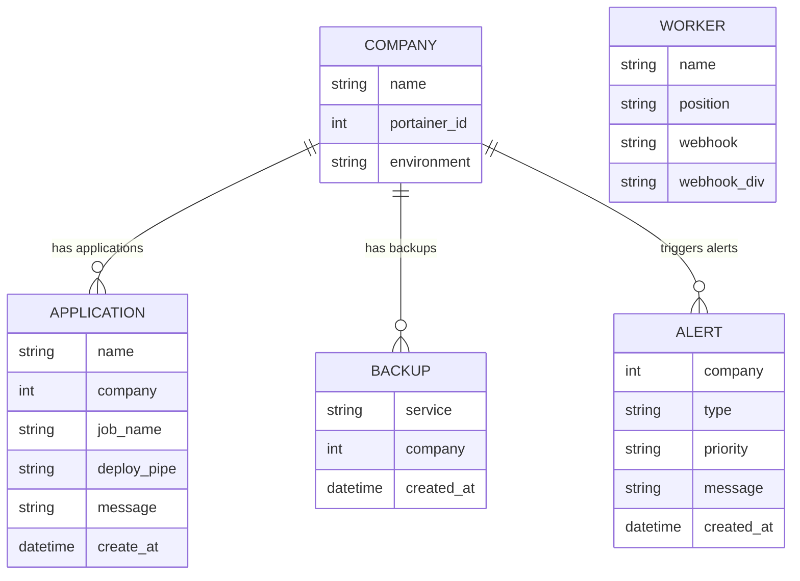

```mermaid
erDiagram
    COMPANY {
        string name
        int portainer_id
        string environment
    }
    APPLICATION {
        string name
        int company
        string job_name
        string deploy_pipe
        string message
        datetime create_at
    }
    BACKUP {
        string service
        int company
        datetime created_at
    }
    ALERT {
        int company
        string type
        string priority
        string message
        datetime created_at
    }
    WORKER {
        string name
        string position
        string webhook
        string webhook_div
    }

    COMPANY ||--o{ APPLICATION : "has applications"
    COMPANY ||--o{ BACKUP : "has backups"
    COMPANY ||--o{ ALERT : "triggers alerts"
    
```